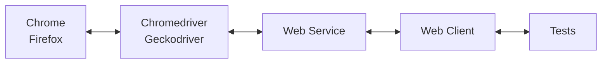

### gost
Testing framework based on [W3C Driver Protocol](https://w3c.github.io/webdriver/) 



### Support 
Chrome and Firefox

### Configuration 
Congifuration is done through `.config` file in the root directory.
This file can be named anything, e.g.: ".env", "settings", "driver.conf",
as long as it's name is set in `config` package and it's variables are
correctly referenced.

If no '.config' file defined, default values will be set:
```golang
func DefaultConfig() *WebConfig {
  return &WebConfig{

    // WebServer default address
    WebServerAddr:    "http://localhost:8080",

    // WebDriver default address
    WebDriverAddr:    "http://localhost:4444",

    // File name in the root of project where webdriver logs will be added
    DriverLogsFile:   "../driver.logs",

    // When set to 'true' screenshot will be made on failed 'find element' call
    ScreenshotOnFail: true,

    // Defines explicit timeout in seconds to wait for webelement
    // WebService will retry to find element within this timeframe, i.e. 20 seconds
    WaitForTimeout:   20,

    // Defines a pause in milliseconds between each retry calls to POST /session/{sessionId}/element
    WaitForInterval:  200,

    // Directory (in this case a root) where you can store .js scripts
    JsFilesPath:      "../",

    // Directory where screenshots will be stored after each failed attempt to find element
    ScreenshotsPath:  "../",

    // Directory where Chrome record.json files are stored
    RecordsPath:      "../",
  }
}
```

### Usage
Run the test with `go test` command:
```
go test -v -count=1 test/driver.go -run TestDriver
``` 
`-v`, shows test output in verbose mode  
`-count=1`, discards test cache  
`test/driver/driver_test.go`, specifies test directory  
`-run`, pattern for test name  
  
Run tests with `Makefile`:
```
make driver
```

TestDriver  
```
func TestDriver(t *testing.T) {

    // this line initializes service, client, driver
    d, tear := gost.Gost(
        capabilities.Browser("chrome"),
    )

    // quits driver and gracefully shuts down service
    defer tear()

    // opens new tab
    d.Open("https://www.google.com")

    // finds and clicks on element 
    // with text/value/aria-label "Gmail" if exists,
    // otherwise will panic and make a screenshot of the page
    d.Cl("Gmail")
}
```
Other tests: 

```
test
|-- actions_test.go
|-- click_test.go
|-- command_test.go
|-- error_test.go
|-- find_test.go
|-- home_test.go
|-- keys_test.go
|-- quit_test.go
|-- record_test.go
|-- screenshot_test.go
|-- script_test.go
|-- service_test.go
|-- session_test.go
|-- status_test.go
|-- steps_test.go
|-- tab_test.go
|-- text_test.go
`-- url_test.go
```

